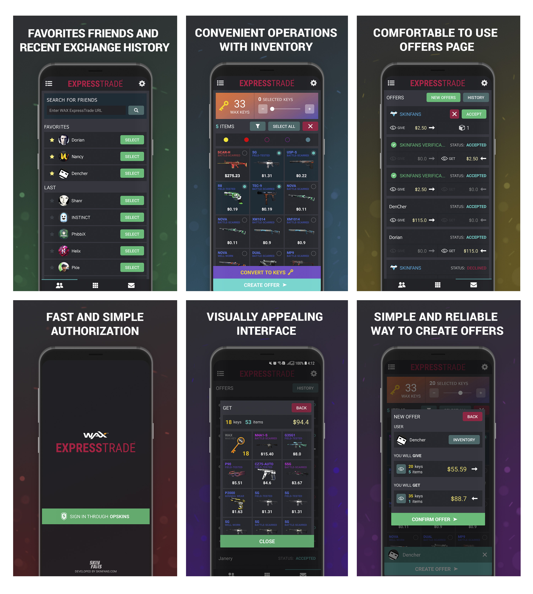
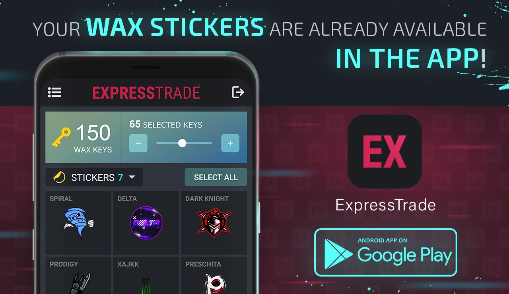
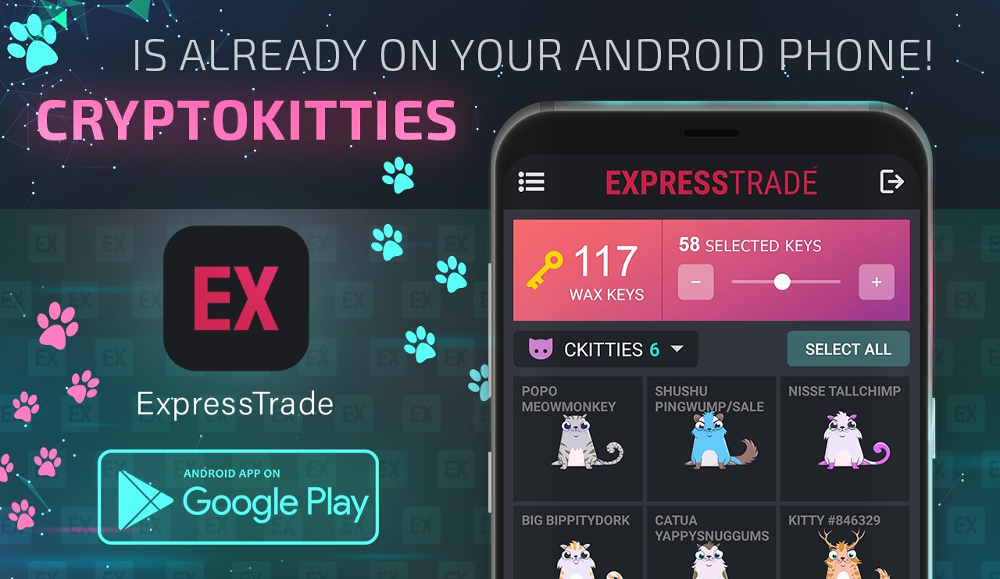

# The source code of the native app ExpressTrade for Android

**SKINFANS** provides you the Source Code of the App ExpressTrade for Android. We have done quite a lot of work to developing this Application and will continue to improve it for you!
Sure, you could download source code to look through or even try it.

The **./app** folder contains all the necessary data for building a project in Android Studio.
- **./app/src/main/java** - all project code (core, activities, fragments, ...)
- **./app/src/main/res** - all project resources (icons, images, ...)
- **./app/libs** - the folder contains the library for converting svg to png, used to render the CryptoKitties category.

## Screenshots:

## Visit us on:
- Site: https://skin.fans
- Twitter: https://twitter.com/skinfans
- Android app: https://play.google.com/store/apps/details?id=fans.skin.expresstrade
